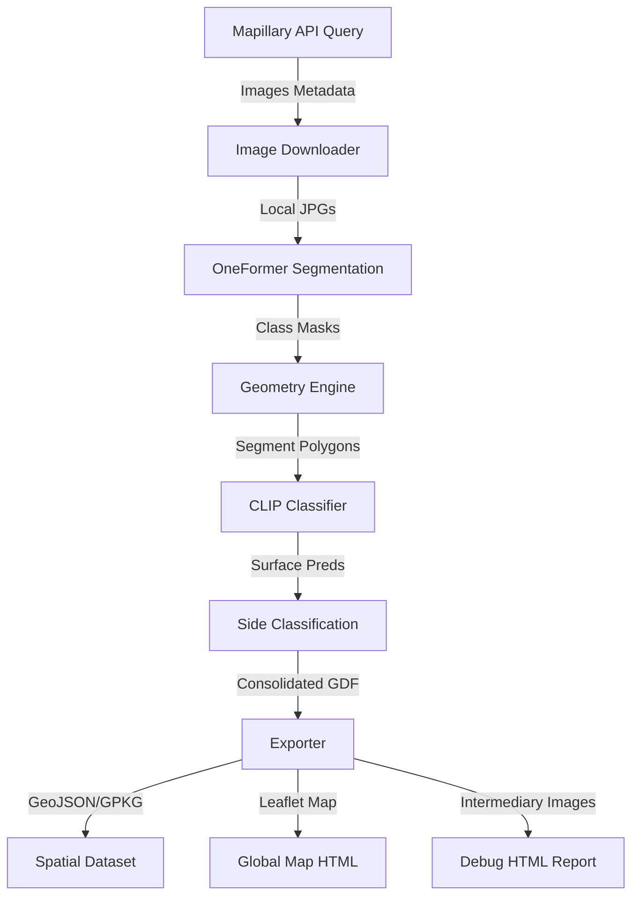

# Architecture Overview

Deep Pavements Lite uses a multi-modal computer vision pipeline to extract and classify sidewalk and road surface materials from street-level photographs.

---

## ⚙️ The Execution Pipeline

The processing pipeline runs in several distinct phases:

### 1. Image Download & Bounding Box Query
The pipeline queries the Mapillary Graph API v4 for all image coordinates, sequences, and metadata falling inside the requested bounding box. Images are downloaded asynchronously to disk (supporting downscaling for speed and memory conservation).

### 2. Semantic Segmentation (OneFormer)
Each image is processed with **OneFormer** (trained on Cityscapes) to generate a semantic mask segmenting:
- **Roads** (Class ID `0`)
- **Sidewalks** (Class ID `1`)
- **Cars** (Class ID `13`)

### 3. Geometry & Polygon Extraction
The pipeline extracts shapes from the segmentation mask:
- Contours are converted to Shapely polygons.
- The **Road Axis Line** is computed to divide the view.
- Sidewalk segments are sorted into **left** and **right** regions relative to the camera heading and road axis.

### 4. CLIP Classification
For each detected road or sidewalk polygon:
1. The bounding box of the polygon is cropped from the original street image.
2. The crop is passed to the **fine-tuned CLIP model** (`ViT-B/32`).
3. The model classifies the surface into one of 11 canonical materials (e.g., asphalt, concrete, paving stones, ground).

### 5. Consolidation & Export
Results are aggregated into a single GeoDataFrame where each image represents a point feature containing:
- `road`: surface type and confidence.
- `left_sidewalk`: surface type (or `no_sidewalk` / `car_hindered`).
- `right_sidewalk`: surface type (or `no_sidewalk` / `car_hindered`).

---

## 🛠️ Code Module Layout

The codebase has been refactored for clarity and modularity under `modules/`:

- **`pipeline.py`:** Core entry point coordinating the end-to-end processing.
- **`segmentation.py`:** Handles image segmentation with OneFormer or fallback heuristics.
- **`classification.py`:** Prepares crops and coordinates CLIP surface classification.
- **`models.py`:** Model weights download and instance factories.
- **`geometry.py`:** Spatial operations, road axis computation, left/right sorting.
- **`visualization.py`:** Renders interactive Leaflet maps.
- **`debug.py`:** Generates localized intermediary debug images and HTML reports.
- **`constants.py`:** Configuration parameters, file extensions, and class mappings.
